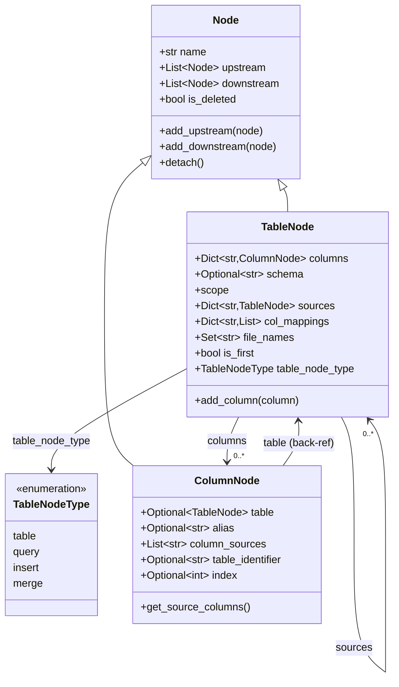
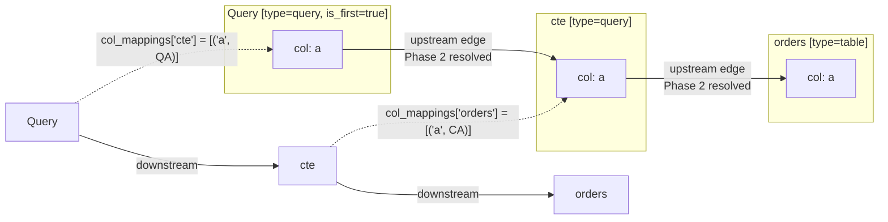
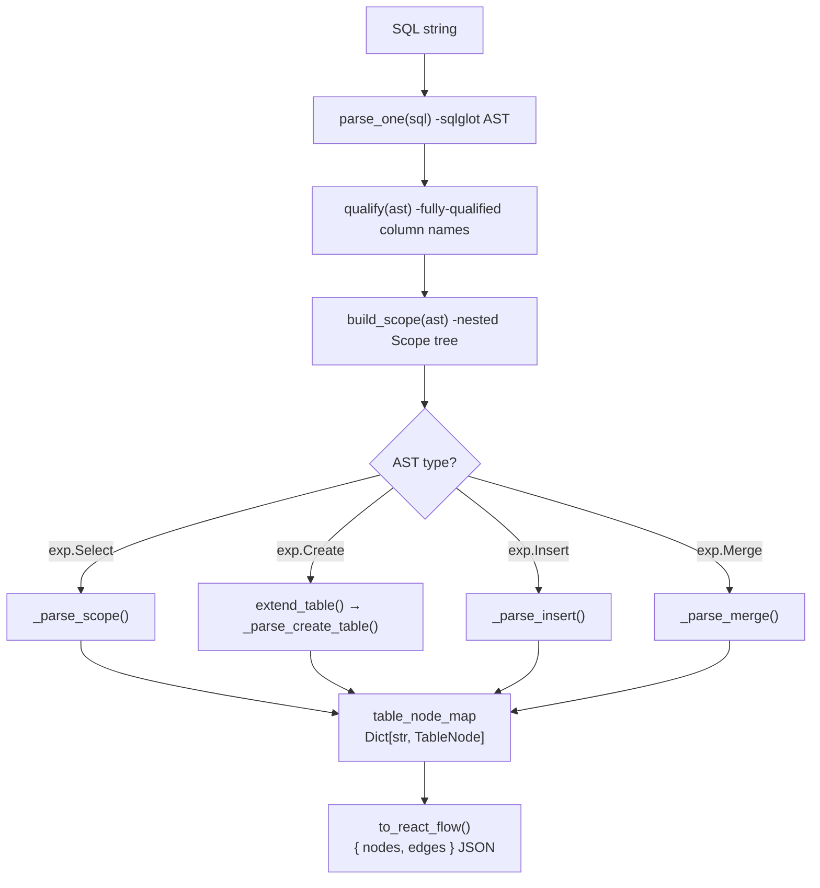
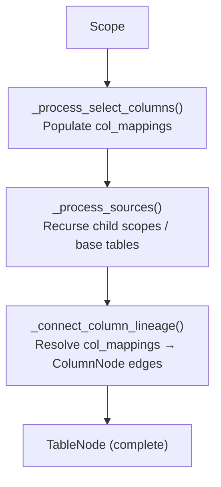
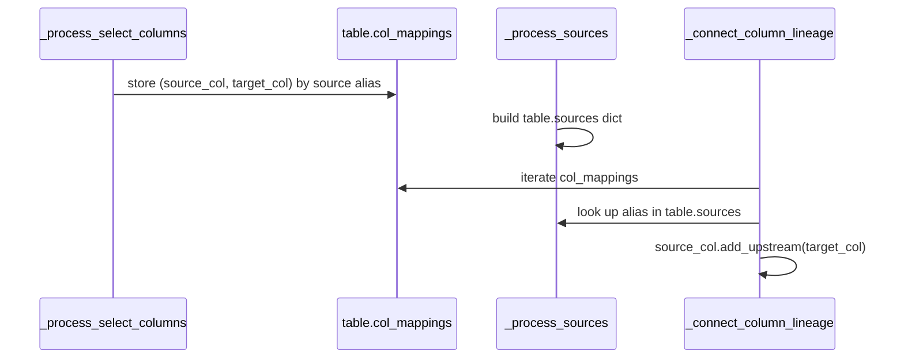
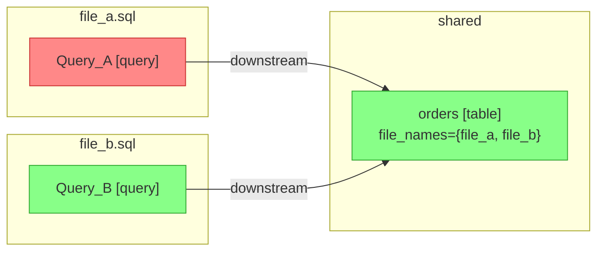

# Parser Internals
Parser leverage the `sqlglot` library and its related helper function to parse SQL into an AST and Scope tree. After that the parser builds a `LineageMap` object that stores the lineage graph.
LineageMap transforms SQL text into an in-memory directed graph of `TableNode` and `ColumnNode` objects. This graph is the source of truth for column-level lineage and can be serialised to React Flow JSON for visualisation.

---

## Node Model



### Naming Convention: upstream / downstream

The `upstream` / `downstream` fields use a **consumer-centric** convention that is the inverse of typical data-flow terminology:

| Field on node X | Meaning |
|---|---|
| `X.downstream` | The tables/columns that X **reads from** (X's data sources) |
| `X.upstream` | The tables/columns that **read from** X (X's consumers) |

So if query `Q` selects from table `T`, then `Q.downstream` contains `T`, and `T.upstream` contains `Q`.

---

## Graph Structure

For the query:

```sql
WITH cte AS (SELECT a FROM orders)
SELECT a FROM cte
```

The resulting graph looks like this:



- Each box is a `TableNode`; nested items are `ColumnNode` entries in `columns`
- `col_mappings` stores *deferred intent* (Phase 1); the arrows from column to column are *resolved edges* (Phase 2)
- `is_first = True` marks the root node (the outermost query)
- **Arrow direction note**: column arrows follow the `.upstream` pointer direction - `QA → CA` means "QA is in CA's `.upstream` list", i.e. QA consumes CA. Data flows in the **opposite** direction: `orders.a → cte.a → query.a`.

---

## Parsing Pipeline



### Inside `_parse_scope`



---

## Two-Phase Column Wiring

Sources must exist before edges can point at their columns. The parser therefore splits column wiring into two phases.

### Phase 1 - Record intent (`_process_select_columns`)

1. Iterates `scope.expression.selects`
2. For each output column, calls `_parse_column` to extract `(source_table, source_col)` pairs
3. Stores deferred mappings: `table.col_mappings[source_table_alias] = [(source_col_name, target_col_node), ...]`

### Phase 2 - Resolve (`_connect_column_lineage`)

1. Iterates `col_mappings`; looks up each key in `table.sources`
2. If found: `source_table.columns[source_col_name].add_upstream(target_col)`
3. If not found: warning log (column may be from a base table not yet extended)



---

## Multi-File Session Tracking

`LineageMap` maintains a `_file_node_map: Dict[str, List[TableNode]]` that records which nodes were introduced by which file. Each `TableNode` also carries a `file_names: Set[str]` set.

### `clear_file(file_name)` strategy

When a file is removed (e.g. on editor save), the parser must surgically clean up only that file's contributions while keeping nodes shared by other files.

1. **Partition** nodes into non-table (query/scope) and table nodes
2. **Delete all non-table nodes** immediately -they belong to exactly one file
3. **For table nodes**: discard the file ref from `file_names`; run a fixpoint algorithm to find fully orphaned nodes (no remaining `file_names`, no edges to live nodes)
4. **Delete only orphaned table nodes**; keep shared ones



After `clear_file("file_a.sql")`:
- `Query_A` is deleted (non-table node, owned exclusively by `file_a.sql`)
- `orders` keeps `file_b.sql` in `file_names` -**kept**
- `Query_B` is unaffected

---

## DML Support Summary

| Statement | Entry method | Target node type | Notes |
|---|---|---|---|
| SELECT | `_parse_scope` | `query` | Recursive; handles CTEs, subqueries, JOINs |
| CREATE TABLE | `_parse_create_table` | `table` | Column defs from schema; CTAS follows SELECT path |
| INSERT INTO … SELECT | `_parse_insert` | `table` | Explicit or positional column mapping |
| MERGE INTO | `_parse_merge` | `table` | WHEN NOT MATCHED THEN INSERT only |
| UNION / UNION ALL | `_parse_union` | `query` | Column lineage wired by ordinal index |

---

## Public API

```python
from lineage import LineageMap, SqlFileLoader
from lineage import LineageException, TableNotFoundException, ColumnMismatchException
```

### `LineageMap()`

| Method | Signature | Description |
|---|---|---|
| `parse_sql` | `(sql, name=None, file_name=None, dialect=None)` | Parse a single SQL statement and build the lineage graph. `name` becomes the root node name; `file_name` is tracked in `_file_node_map`. `dialect` is an optional sqlglot dialect string (e.g. `"bigquery"`). |
| `parse_sql_file` | `(sql, file_name=None, dialect=None)` | Split a SQL string into individual statements using `sqlglot.parse()` and call `parse_sql` on each. Use this when the input may contain multiple statements. |
| `extend_table` | `(table_name=None, sql=None, file_name=None)` | Load a `CREATE TABLE` definition and splice it into the existing graph, replacing the bare stub and re-wiring column edges. |
| `get_column_impact` | `(table_name, col_name)` | BFS upstream and downstream from a given column. Returns `{"column", "upstream", "downstream"}` lists of `{table, column}` dicts. |
| `clear` | `()` | Tear down the entire graph and reset all internal state. |
| `clear_file` | `(file_name)` | Remove all lineage state contributed by a specific file, preserving shared nodes. |

### `SqlFileLoader(sql_directory)` (Not integrated yet)

Handles SQL file discovery and auto-extension of stub table nodes. Separates file-system concerns from `LineageMap`.

| Method | Signature | Description |
|---|---|---|
| `resolve` | `(table_name)` | Find the `.sql` file that defines `table_name` by searching `sql_directory` recursively. Returns a `Path` or `None`. |
| `load` | `(table_name)` | Return the SQL text for `table_name`. Raises `TableNotFoundException` if not found. |
| `auto_extend` | `(lm)` | For every stub node in `lm` (no columns, scope is `exp.Table`), attempt to locate its `.sql` file and call `lm.extend_table()`. |
| `changed_files` | `()` | Return all `.sql` files whose content has changed since the last hash snapshot. |
| `save_snapshot` | `(lm, path)` | Pickle `lm` and the file hash cache to `path`. |
| `load_snapshot` | `(path, sql_directory)` | Restore a `(LineageMap, SqlFileLoader)` tuple from a pickle snapshot. |
